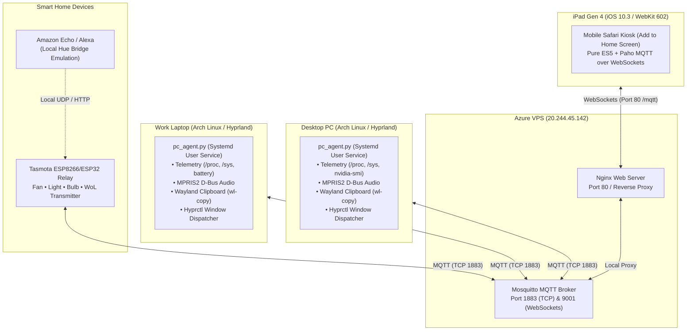

# iPad Gen 4 Smart Home & Battle Station Dock

[](LICENSE)
[-lightgrey.svg)]()
[]()
[]()
[]()

Turn a retired, obsolete **iPad Gen 4 (iOS 10.3.3 / WebKit 602)** into a permanent, mission-control battle station dashboard, smart home controller, multi-machine stream deck, and cross-device clipboard teleport.

---

## 📸 Overview & Features

```
┌────────────────────────────────────────────────────────────────────────┐
│                        IPAD DOCK WEB INTERFACE                         │
├───────────────┬───────────────┬───────────────┬──────────────┬─────────┤
│    PAGE 1     │    PAGE 2     │    PAGE 3     │    PAGE 4    │ PAGE 5  │
│  Smart Home   │  Battle HUD   │ Media Studio  │ Stream Deck  │ Focus   │
│ & Tasmota Rel │ Cockpit Rings │ Vinyl & MPRIS │ Teleport Sync│  Timer  │
└───────────────┴───────────────┴───────────────┴──────────────┴─────────┘
```

### 1. 🏠 Page 1: Smart Home & Tasmota Power
- **Live Device Toggles**: Fan, Room Light, and Accent Bulb with real-time bidirectional MQTT sync (`room_light`).
- **Scene Quick Presets**: One-tap scene triggers:
  - ☀️ *Wake Day* (Lights ON, Fan ON)
  - 🛋️ *Relax* (Accent light, gentle fan)
  - ⚡ *Desk Focus* (Task light, cooling fan)
  - 🌙 *Goodnight* (All lights off, fan timer)
  - 🛑 *All Off* (Master power cut)
- **Workstation Power**: Remote Sleep, Shutdown, Restart, and Wake-on-LAN (WoL) for Desktop PC & Laptop.

### 2. 📊 Page 2: Battle Station Cockpit (Telemetry HUD)
- **Workstation Switcher**: Toggle telemetry cockpit between **🖥️ Desktop PC** and **💻 Work Laptop**.
- **Station Identity Banner**: Machine hostname, live state badge, LAN IP address, motherboard model, and Linux kernel release.
- **5 Animated Circular SVG Gauges**:
  1. ⚡ **CPU Load**: Live % utilization with current clock frequency (MHz).
  2. 🧠 **Memory (RAM)**: Live RAM % utilization with `Used / Total GB`.
  3. 🎮 **GPU Load**: Core utilization % (or VRAM %) with GPU model title.
  4. 🌡️ **Core Thermals**: Real-time package temperature with color warning threshold ($\ge 80^\circ\text{C}$) and GPU temperature.
  5. 💾 **Root SSD / 🔋 Battery**:
     - *Desktop PC*: Root NVMe partition used % with `Used / Total GB`.
     - *Work Laptop*: Live battery % with charging and AC rail status.
- **6 Detailed Hardware Breakdown Cards**:
  1. **⚙️ CPU & Architecture**: Model string, core & thread counts, architecture (`x86_64`), governor, L3 cache size, and dynamic usage bar.
  2. **🧠 Memory (RAM & Swap)**: Multi-segment bar illustrating `[Used | Cached | Free]` distribution, plus Swap usage bar.
  3. **🎮 GPU & Display Output**: GPU model, driver version, VRAM progress bar, and active display resolutions / refresh rates via `hyprctl`.
  4. **💾 Storage & Filesystem**: Root NVMe partition storage usage bar and available free space.
  5. **🗄️ Motherboard & Firmware**: Board model, vendor, BIOS/UEFI version, and chassis form factor.
  6. **🌐 Network & Power**: Network adapter (`Ethernet` / `WiFi`), IP address, power source, and system uptime counter.

### 3. 🎵 Page 3: Media Studio & Audio Hub
- **Target Workstation Selector**: Switch audio control between Desktop PC and Work Laptop.
- **Spinning Vinyl Record**: Real-time album art fetched over MPRIS2 D-Bus (Spotify, YouTube, VLC, browser tabs).
- **Animated Audio Equalizer**: Bouncing equalizer bars active during playback.
- **Full Transport Controls**: Previous, Play / Pause (optically centered SVG), and Next.
- **Volume Controller**: Master output volume slider with **touch isolation** (prevents slider dragging from triggering carousel page swiping), mute button, and $\pm 5\%$ step buttons.

### 4. 🎛️ Page 4: Stream Deck & Cross-Device Teleport
- **Quick Apps (4×2 Grid)**:
  - 💬 WhatsApp, ✨ Gemini, 🧠 Claude, 🎬 YouTube, 🐙 GitHub, 🤖 ChatGPT, ✉️ Gmail, 🎵 Spotify.
  - Native **Hyprland window focus-or-open**: Brings existing browser window/tab into focus if already open; launches fresh session if closed.
- **System Controls (1×6 Macros)**:
  - 🎙️ **Microphone**: Live indicator & one-tap mute/unmute toggle (`wpctl`).
  - 💻 **Terminal**: Launches Ghostty / Alacritty shell.
  - 🌐 **Browser**: Launches Chrome / Firefox.
  - 📸 **Screenshot**: Triggers Omarchy / Grim screen capture.
  - 📁 **Files**: Instantly opens Nautilus file manager.
  - 🔕 **Silence DND**: Toggles desktop notification Do-Not-Disturb (`makoctl`).
- **Cross-Device Teleport (Clipboard Bridge)**:
  - Bi-directional clipboard sync between Desktop PC, Work Laptop, and iPad.
  - 📥 *Copy from PC* / 📤 *Paste to PC* (`wl-paste` & `wl-copy`).
  - 📥 *Copy from Laptop* / 📤 *Paste to Laptop*.
  - 🔄 *1-Tap Direct Sync*: `PC ➔ Laptop` and `Laptop ➔ PC`.
  - 🌐 *Beam URL*: Opens any URL typed on iPad immediately on workstation.

### 5. ⏱️ Page 5: Desk Focus Pomodoro Timer
- **Circular Countdown Ring**: Animated SVG timer ring showing elapsed session time.
- **Quick Presets**: 🍅 25m Focus, ☕ 5m Break, 🌴 15m Long Break, ⚡ 45m Deep Work.
- **Sound Alert**: Built-in audio chime alert upon session completion.

### 6. 🌙 Ambient Nightstand Mode
- Tap the **🌙 icon** in the header to enter an Apple Watch style ambient night clock overlay with ultra-low brightness and high-visibility time. Tap anywhere to wake the dock.

---

## 🏛️ System Architecture



---

## 📁 Repository Structure

```
├── README.md                          # Comprehensive project documentation
├── setup_plan.md                      # Technical roadmap and architecture
├── azure/                             # Cloud relay configuration
│   ├── docker-compose.yml             # Mosquitto MQTT & Nginx services
│   ├── mosquitto/
│   │   └── mosquitto.conf             # Mosquitto WebSockets & TCP configuration
│   └── deploy.sh                      # Cloud provisioning script
├── web/                               # iOS 10.3 Safari compatible Web Dock UI
│   ├── index.html                     # Fullscreen kiosk dashboard markup
│   ├── style.css                      # High-density touch stylesheet (Pure CSS)
│   ├── app.js                         # 100% Pure ES5 reactive controller & MQTT client
│   ├── config.js                      # Device registry, MQTT settings, and targets
│   ├── paho-mqtt.js                   # Paho MQTT JavaScript client
│   └── version.json                   # Automated deployment version tracker
├── agents/                            # Workstation background agents
│   ├── pc_agent.py                    # Multi-machine Python daemon (Systemd/Task Scheduler)
│   ├── requirements.txt               # Python dependencies
│   ├── ipad-dock-pc.service           # Systemd user service unit for Desktop PC
│   ├── ipad-dock-laptop.service       # Systemd user service unit for Work Laptop
│   └── install_windows_service.bat    # Windows Task Scheduler installer
├── scripts/
│   └── deploy_web.sh                  # 1-command deployment & remote iPad auto-reload
└── docs/                              # In-depth technical guides
    ├── ipad_setup_guide.md            # Guided Access & Safari kiosk setup
    ├── pc_laptop_setup.md             # Wake-on-LAN, power states, and agent configuration
    └── tasmota_and_alexa_guide.md     # MQTT broker pairing & Alexa Hue emulation
```

---

## ⚡ Technical Mandates & Compatibility

### Pure ES5 Mandate (iOS 10.3 Safari / WebKit 602)
Older iOS devices like the iPad Gen 4 **fail silently on modern JavaScript syntax**:
- ❌ **Forbidden**: `let`, `const`, `() => {}`, backtick template strings (`` ` ``), `async`/`await`, `class`, optional chaining `?.`, default parameters.
- ✅ **Required**: `var`, traditional `function () {}`, string concatenation (`+`), `XMLHttpRequest`.
- Every deployment verifies 100% ES5 compliance before publishing.

### Touch Slider Isolation
Horizontal range sliders on touch screens can accidentally trigger page swipe carousel handlers. The volume slider implements **three-layer event isolation**:
1. Viewport filter: `initSwipeGestures` ignores touches starting on range inputs and slider wrappers.
2. Element listeners: `touchstart`, `touchmove`, and `touchend` execute `event.stopPropagation()`.
3. CSS containment: `touch-action: pan-x` applied to all slider tracks.

---

## 🚀 Deployment & Usage

### 1. One-Click Web Deployment to Azure
Whenever you edit files in `web/`:
```bash
./scripts/deploy_web.sh
```
This script automatically:
1. Increments `web/version.json` with a build timestamp.
2. Syncs web assets to the Azure VPS web root (`/home/rishal/IPadDock/web/`).
3. Broadcasts `cmnd/ipaddock/reload` over MQTT, causing the iPad to **instantly refresh itself** without manual intervention!

### 2. Running Workstation Agents

#### Desktop PC:
```bash
systemctl --user enable --now ipad-dock-pc.service
```

#### Work Laptop:
```bash
systemctl --user enable --now ipad-dock-laptop.service
```

#### Check Agent Status:
```bash
systemctl --user status ipad-dock-pc.service
journalctl --user -u ipad-dock-pc.service -f
```

---

## 📚 In-Depth Guides
- [iPad Kiosk & Guided Access Setup Guide](docs/ipad_setup_guide.md)
- [PC & Laptop Agent Setup Guide](docs/pc_laptop_setup.md)
- [Tasmota & Alexa Integration Guide](docs/tasmota_and_alexa_guide.md)

---

## 📄 License
MIT License. Created by [Rishal](https://github.com/rishalsha).
