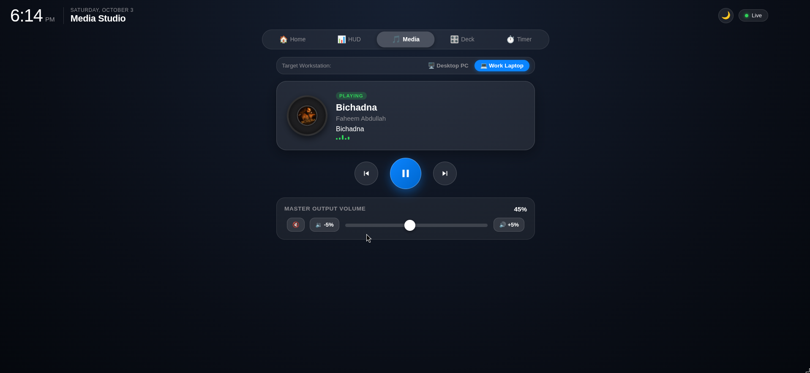

# Media Studio & Audio Hub

The Media Studio page (**Page 3**) turns the iPad into a dedicated desk music controller and album artwork display for your workstations.



---

## 🎵 Features & Capabilities

- **Workstation Switcher**: Toggle controls between **Desktop PC** and **Work Laptop**.
- **Spinning Vinyl Record**: 
  - Dynamically displays album artwork received from MPRIS2 media players (Spotify, YouTube in Chrome/Firefox, VLC, mpv).
  - Rotates continuously during playback with hardware-accelerated CSS animations (`@keyframes vinylSpin`).
  - Seamless fallback to musical emoji icon when no album art is provided.
- **Audio Equalizer Animation**: 5 animated vertical equalizer bars bounce smoothly when media state is `Playing`.
- **Full Transport Controls**:
  - `⏮️ Previous Track`: MPRIS `Previous` method call.
  - `⏯️ Play / Pause`: MPRIS `PlayPause` toggle. Uses an optically centered SVG play triangle.
  - `⏭️ Next Track`: MPRIS `Next` method call.
- **Master Volume Slider**:
  - Direct output volume control via PipeWire `wpctl set-volume @DEFAULT_AUDIO_SINK@ <val>%` (or PulseAudio `pactl`).
  - Quick buttons: Mute (`🔇`), `-5%` (`🔉`), and `+5%` (`🔊`).
  - **Triple-layer Touch Isolation**: Prevents dragging the volume slider thumb horizontally from triggering carousel page swipe navigation.

---

## 🎧 Linux MPRIS2 D-Bus Architecture

The workstation background daemon (`agents/pc_agent.py`) monitors all active MPRIS media players on the user session D-Bus:

```python
# Queries active media player buses
bus = Gio.bus_get_sync(Gio.BusType.SESSION, None)
names = [n for n in bus.call_sync("org.freedesktop.DBus", "ListNames", ...)]
mpris_players = [n for n in names if n.startswith("org.mpris.MediaPlayer2.")]
```

When metadata or playback changes, the daemon packages:
- `status`: `"Playing"`, `"Paused"`, or `"Stopped"`
- `title`: Current track title
- `artist`: Artist name
- `album`: Album name
- `artUrl`: Album art URL (e.g. `https://i.scdn.co/image/...` or local file)
- `volume`: Current master sink volume (0-100%)

And broadcasts it to `stat/<machine>/media` over MQTT.
