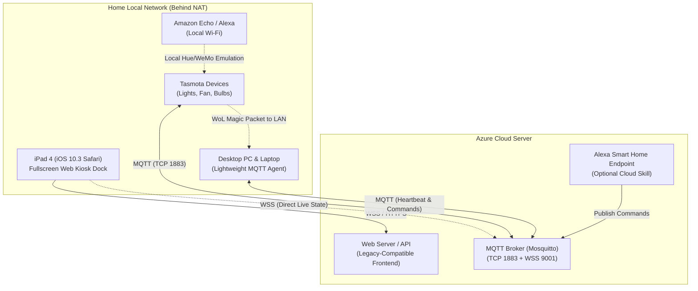

# iPad Gen 4 Smart Home Dock: Architecture & Implementation Plan

This plan outlines the architecture, hardware constraints, network communication, and implementation phases to turn an **iPad Gen 4** into a dedicated wall/desk smart home dock.

---

## 1. Architecture Overview

Because the iPad, Tasmota devices, and PC/laptops are on your home local network (LAN) behind a home NAT router, the **Azure Server** acts as the central cloud relay (MQTT Broker + Web Dashboard host). 

Devices make **outbound connections** to Azure, eliminating the need for complex port forwarding or dynamic DNS on your home router.

---

## 2. Key Challenges & Technical Solutions

### A. iPad Gen 4 Constraints (iOS 10.3.3 / 10.3.4)
The iPad 4 uses a 32-bit Apple A6X chip with 1 GB RAM, locked to iOS 10.
- **Browser Compatibility**: Safari on iOS 10 lacks full support for modern ES2020+ JavaScript features (e.g. optional chaining `?.`, nullish coalescing `??`, modern Webpack/Vite bundles often crash).
  - *Solution*: Build the dock UI using **Vanilla JavaScript (ES5/ES6 baseline)** with CSS3 Flexbox/Grid verified on WebKit 602 (iOS 10). Zero heavy framework overhead ensures instantaneous touch response and no memory crashes.
- **Kiosk Mode (Always-On Fullscreen)**:
  - Add `<meta name="apple-mobile-web-app-capable" content="yes">` and Apple touch icons so saving to Home Screen launches it as a standalone, chromeless app (no URL bar or browser tabs).
  - Use iOS **Guided Access** (`Settings > Accessibility > Guided Access`) to lock the iPad to the app and prevent the screen from turning off.
- **TLS / SSL Certificates**:
  - iOS 10 lacks modern root certificates (ISRG Root X1 for Let's Encrypt). If using HTTPS via Let's Encrypt, the ISRG Root X1 CA certificate profile can be installed on the iPad, or Cloudflare / standard SSL with compatible ciphers.

---

### B. Device Control Strategy

#### 1. Tasmota Devices (Lights, Fan, Bulbs)
- **Primary Control**: MQTT. Tasmota has native MQTT support. Once configured to point to your Azure broker:
  - Publish to `cmnd/<device_topic>/POWER` (`ON`, `OFF`, `TOGGLE`).
  - Web UI subscribes to `stat/<device_topic>/POWER` for real-time button state feedback.
- **Alexa Local Integration**: Tasmota has built-in **Hue Bridge** and **Belkin WeMo emulation**. Alexa discovers and controls your Tasmota switches directly over local Wi-Fi without needing cloud skills.

#### 2. PC & Laptop Management (Sleep, Power Off, Wake, Power On)
- **Lightweight PC/Laptop Agent**: A tiny background service (Python script or compiled binary) running on each machine that connects to the Azure MQTT broker.
  - **Sleep**: Triggers OS suspend (`rundll32.exe powrprof.dll,SetSuspendState 0,1,0` on Windows, or `systemctl suspend` on Linux).
  - **Power Off**: Triggers shutdown (`shutdown /s /t 0` on Windows, or `systemctl poweroff` on Linux).
  - **Online/Offline Status**: Sends MQTT heartbeats (LWT - Last Will and Testament) so the iPad dock displays accurate status badges.
- **Wake-On-LAN (WoL) & Power On**:
  - *The challenge*: Azure is in the cloud and cannot directly broadcast Layer-2 WoL packets into your home LAN.
  - *Solution 1 (Tasmota WoL)*: Tasmota firmware includes a built-in `WakeOnLan` command (`WakeOnLan <MAC_ADDRESS>`). Azure sends an MQTT command to a Tasmota device (e.g., smart plug or light switch), and that Tasmota device broadcasts the WoL packet inside your home network!
  - *Solution 2 (Smart Plug AC Restore)*: For desktop PCs, set BIOS *AC Back / After Power Loss* to **"Power On"**. Toggle the Tasmota smart plug off and on to boot the PC from cold shutdown.

---

## 3. Component Breakdown

| Component | Technology | Role |
| :--- | :--- | :--- |
| **iPad Dock UI** | Vanilla HTML5 / CSS3 / ES5 JS + MQTT over WebSocket | Touchscreen dashboard with tile switches, sliders (brightness/speed), and PC power controls |
| **Azure Relay** | Mosquitto MQTT Broker + Node.js/Python or Nginx | Handles message passing, user authentication, and serves the web frontend |
| **PC/Laptop Agent** | Python / PowerShell / Go daemon | Background service listening to MQTT for `sleep`, `hibernate`, `shutdown` commands |
| **Tasmota Devices** | Native Tasmota MQTT client | Subscribes to commands, reports state, sends WoL packets to PCs |
| **Voice Control** | Alexa Hue Emulation & Azure Skill | Voice control for lights/fans and PC control commands |

---

## 4. Implementation Roadmap

### Phase 1: Azure Relay & Message Broker Setup
1. Configure **Eclipse Mosquitto** on the Azure server with:
   - Port `1883` (Standard MQTT for Tasmota & PC agents).
   - Port `9001` (MQTT over WebSockets for the iPad web browser).
   - Basic username/password authentication and TLS/SSL encryption.
2. Set up a simple HTTP/HTTPS server (Nginx or lightweight Node/Python) to host the frontend dashboard.

### Phase 2: PC & Laptop Control Agent
1. Create a cross-platform Python/Go agent for Windows/Linux.
2. Implement actions:
   - `sleep`, `shutdown`, `restart`.
   - Heartbeat and Last-Will-and-Testament (LWT) for live status on the dock.
3. Test WoL triggering via Tasmota's `WakeOnLan` command or local relay.

### Phase 3: iPad Gen 4 Web Dock Dashboard
1. Develop a responsive, dark-mode, touch-optimized grid dashboard.
2. Target iOS 10 WebKit compatibility:
   - Clean, large touch targets (tiles).
   - Real-time state updates using `paho-mqtt.js` or WebSocket.
   - Quick action scenes (e.g., "Work Mode", "Night Mode", "All Off").
   - Kiosk meta tags for standalone fullscreen mode.

### Phase 4: Alexa & Advanced Features
1. Configure Tasmota Alexa Hue/WeMo emulation for direct local voice control.
2. (Optional) Deploy an Alexa Smart Home skill or webhook endpoint on Azure for PC commands ("Alexa, turn off my PC").
